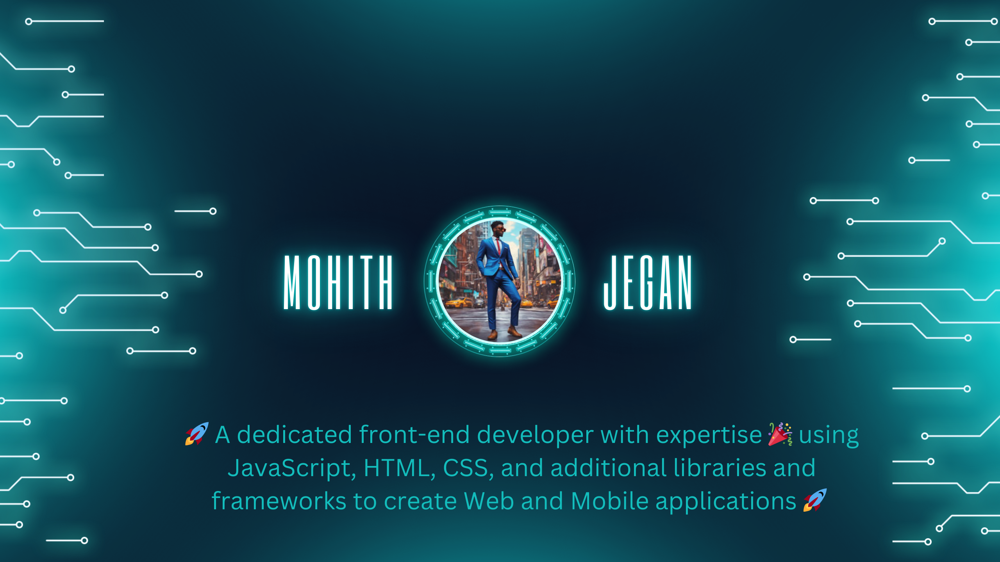

<!--
**MohithJegan/MohithJegan** is a ✨ _special_ ✨ repository because its `README.md` (this file) appears on your GitHub profile.

Here are some ideas to get you started:

- 🔭 I’m currently working on ...
- 🌱 I’m currently learning ...
- 👯 I’m looking to collaborate on ...
- 🤔 I’m looking for help with ...
- 💬 Ask me about ...
- 📫 How to reach me: ...
- 😄 Pronouns: ...
- ⚡ Fun fact: ...
-->
## 🧑‍💼 My Profile

## Frontend Developer | UI/UX Specialist | Web Enthusiast

As a dedicated frontend developer, I specialize in crafting visually stunning and highly functional web applications that enhance user experiences. With a strong foundation in **HTML, CSS, and JavaScript**, and proficiency in modern frameworks like **React and Angular**, I bring both _technical expertise_ and _creative flair_ to every project.

## 🏅 Skills

1. **HTML**
2. **CSS**
3. **JavaScript**
4. **Responsive Design**
5. **Version Control**

## 🏆 Rating
Below is the knowledge of the skills for total grade of 5.

| SKILL             |   KNOWLDEGE         |
|------------------ |-------------------- |
| HTML              |        4.8          |
| CSS               |        4.6          |
| JavaScript        |        4.5          |
| Responsive Design |        4.5          |
| Version Control   |        4.5          |

## 💼 What I do

- Develop dynamic, user-centered web applications and interfaces
- Collaborate with designers and backend developers to create cohesive and innovative solutions
- Continuously learn and implement the latest web technologies and best practices

## ❤️ Passion

- Transforming creative ideas into functional code
- Enhancing user experiences through thoughtful design and usability
- Staying current with industry trends and emerging technologies

## 📫 How to reach me: 
 
 
 
 
 